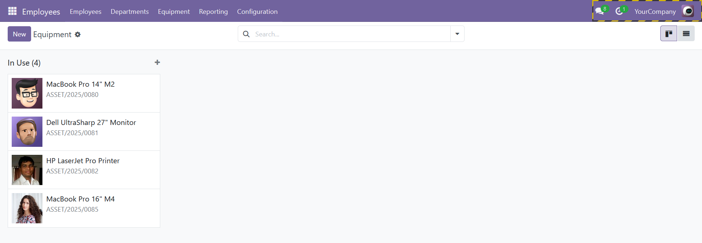
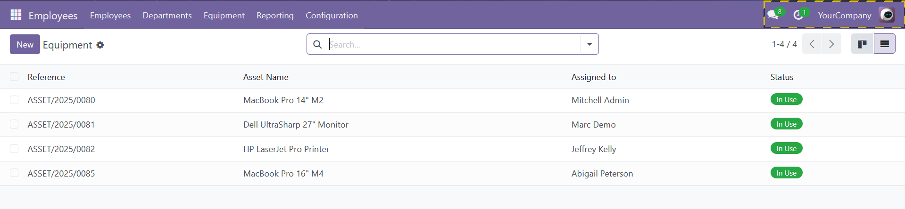
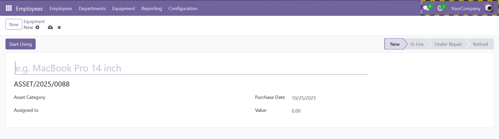
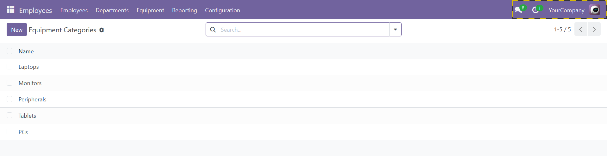
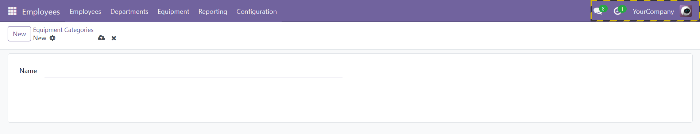

# Asset Management Module for Odoo 18 (om_asset_management)

## Overview

`om_asset_management` is a custom Odoo 18 module designed to manage internal company assets, specifically focusing on equipment assigned to employees within various departments. Developed as part of a software engineering internship project, this module provides a simple yet powerful solution for tracking the lifecycle of assets like laptops, monitors, and office equipment.

This module was built following Odoo's core principles, leveraging the ORM, Views (List, Form, Kanban), Security Groups, and automated workflows. It is designed to integrate seamlessly with the standard `hr` (Human Resources) module.

## Features

### 1. Core Asset Management

-   **Asset Repository:** Create and manage a centralized database of all internal equipment.
-   **Unique Referencing:** Each asset is automatically assigned a unique, sequential reference number (e.g., `ASSET/00001`) for easy tracking.
-   **Detailed Information:** Store key details for each asset, including name, category, purchase date, and value.

### 2. Employee and Department Assignment

-   **Direct Assignment:** Assign each piece of equipment to a specific employee (`hr.employee`).
-   **Automatic Department Linking:** The department field is automatically populated based on the assigned employee, while still allowing for manual overrides.
-   **Technician Assignment:** Assign a responsible technician for maintenance and support.

### 3. Lifecycle & Status Tracking

-   **Workflow-driven Status:** Manage assets through a clear lifecycle with distinct states: `New`, `In Use`, `Under Repair`, and `Retired`.
-   **Header Buttons:** Use intuitive buttons on the form view to progress an asset through its lifecycle (e.g., a "Start Using" button appears only when the asset is "New").
-   **Color-Coded Views:**
    -   The List View uses decorations to color-code rows, making it easy to spot assets requiring attention (e.g., assets `Under Repair` are highlighted in yellow).
    -   The Status field is displayed as a colored badge for quick visual identification.

### 4. User-Friendly Interface

-   **Kanban View:** A modern Kanban board that visualizes all assets grouped by their current status, allowing for easy drag-and-drop management (if extended with automation).
-   **Configurable Categories:** Easily create and manage equipment categories (e.g., Laptops, Monitors, Peripherals) through a dedicated configuration menu.
-   **Integrated Chatter:** Track the complete history of an asset—every assignment change, status update, and internal note—through the integrated chatter functionality.
-   **Robust Security:**
    -   **Manager Role:** Has full CRUD (Create, Read, Update, Delete) access to all assets and configurations.
    -   **User Role:** Has read-only access to view asset information.

## Live Demo (Screenshots)

**Equipment Kanban View:**

  

**Equipment List View (with color-coding):**

  

**Equipment Form View (with header buttons):**

  

**Equipment Categories List View:**

  

**Equipment Categories Form View:**

  

## Technical Stack

-   **Framework:** Odoo Community Version 18
-   **Language:** Python 3.12+
-   **Database:** PostgreSQL 16+
-   **Core Technologies:** Odoo ORM, XML Views (List, Form, Kanban, Search), `mail.thread` mixin.

---

## Installation & Setup

This module is designed to be installed on an existing Odoo 18 instance. If you have not yet installed Odoo, please refer to the installation guide provided in the `om_hr_portal` module's README.

### Prerequisites

-   An operational Odoo 18 instance.
-   The standard **`hr` (Employees)** module must be installed.

### Installation Steps

1.  **Download/Clone the Module:**
    -   Place the entire `om_asset_management` folder inside your Odoo `custom_addons` directory.

2.  **Restart the Odoo Server:**
    -   This is a crucial step to ensure Odoo recognizes the new module. Stop your server (`Ctrl + C`) and start it again.

3.  **Activate Developer Mode:**
    -   Log into your Odoo database, go to `Settings`, scroll to the bottom, and click `Activate the developer mode`.

4.  **Update the Apps List:**
    -   Go to the **Apps** menu.
    -   In the top bar, click **"Update Apps List"** and confirm the update in the dialog box.

5.  **Install the Module:**
    -   In the Apps menu, remove the default "Apps" filter from the search bar.
    -   Search for `Asset Management` or `om_asset_management`.
    -   You will see the module card. Click the **"Activate"** button.

The module will be installed, and a new **"Equipment"** menu will appear under the main **"Employees"** application.

---

## Author

- **Name:** Duong Hoang Lan Anh
- **Contact:** dhlananh2309@gmail.com
- **GitHub:** https://github.com/dhlananhh/
